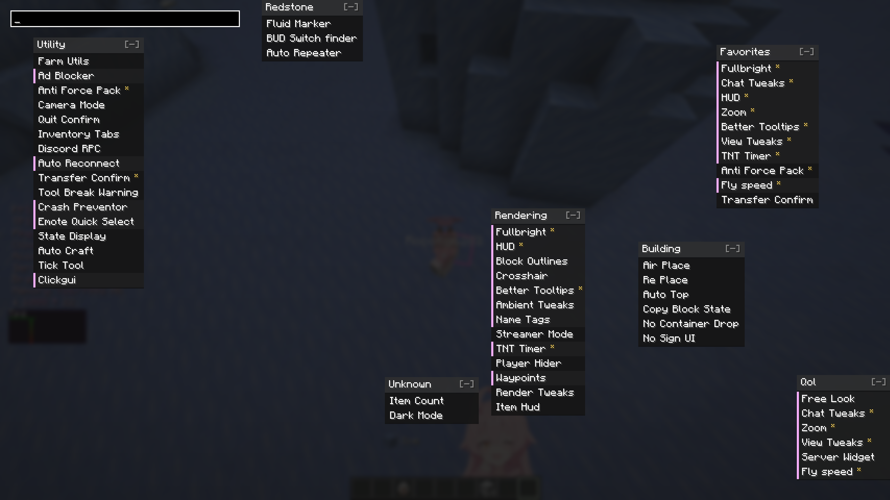

# Cactus-Clickgui

Cactus-Clickgui is a Fabric client addon for Cactus that adds a Cactus module for switching the module list screen to a custom ClickGUI.

When the `Clickgui` module is enabled, opening the Cactus module list uses the custom ClickGUI. When the module is disabled, Cactus uses its normal module screen.

## Screenshot

<!-- Put the enabled screenshot at docs/screenshots/enabled.png. -->

## Features

- Registers as a Cactus module through the Cactus addon entrypoint.
- Uses the module active state as the theme toggle.
- Adds a Cactus color setting for the ClickGUI accent color.
- Falls back to the normal Cactus module screen when disabled.

## Requirements

- Minecraft 26.1.x
- Fabric Loader 0.19.3
- Fabric API
- Cactus 0.13+

